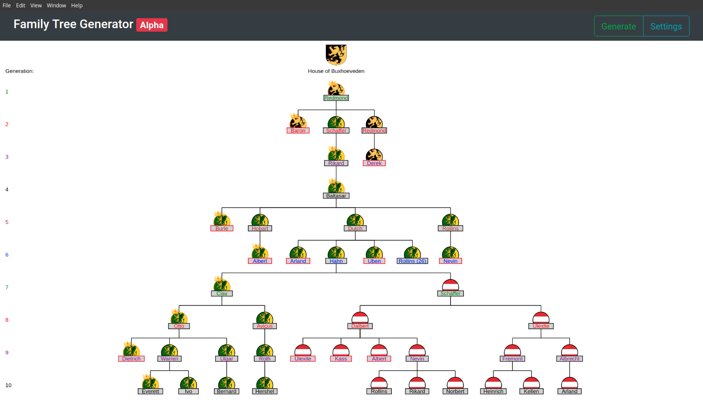
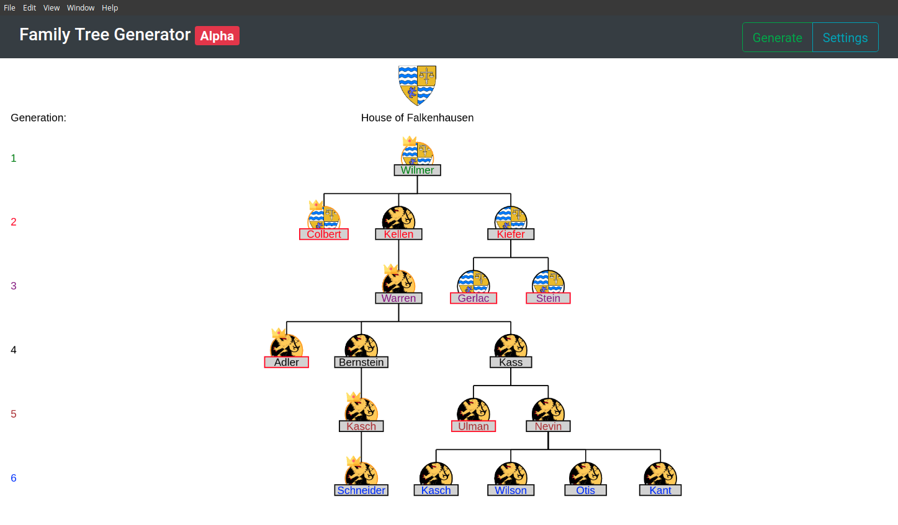

# Family Tree Generator
<p>Application for creating randomly generated family trees.</p>
<p>Early Work-In-Progress.</p>
<p align="center">
  </a>
</p>

Current Features:
- Set number of generations
- Heir Calculation
  - Crown icons indicate primogeniture heir in each generation
  - Succession law customization in progress
- Added support for multiple houses existing in the same tree:
  - Houses change the coat of arms displayed with a person
- Culture groups:
  - Culture affects the first names, house names, and coat of arms
  - Currently only supports German

Future Plans:
- Editing
  - Makes nodes of the tree clickable allowing the user to customize nodes in the tree
- Gallery
  - Will allow for the storing and importing of family trees
- Optimization
  - Optmizing canvas redrawing
  - Optmizing canvas Pan & Zoom
<p align="center">
  </a>
</p>

# Installation
No binarys are currently avalible at this time as the program is still in early development stages

Running
1. Clone this repository and extract
2. Change working directory to new folder
3. Run ```npm install``` to install required node modules
4. Run ```npm start``` to start the program
